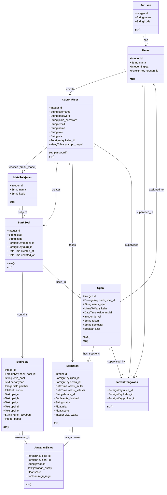

# 4.2. Rancangan Basis Data - Sistem CBT

## 4.2.1. Normalisasi

Dokumen ini menjelaskan proses normalisasi basis data untuk Sistem Computer Based Test (CBT) yang dimulai dari bentuk tidak normal (Unnormalized Form/UNF) hingga bentuk normal terakhir (Boyce-Codd Normal Form/BCNF).

---

## A. Bentuk Tidak Normal (Unnormalized Form - UNF)

Pada tahap awal, data sistem CBT dapat direpresentasikan dalam satu tabel besar yang mengandung semua informasi tanpa memperhatikan redundansi data:

### Tabel: DATA_UJIAN_LENGKAP

| **Atribut** | **Deskripsi** |
|---|---|
| id_ujian | ID Ujian |
| nama_ujian | Nama Ujian |
| token_ujian | Token untuk akses ujian |
| semester | Semester ujian (Ganjil/Genap) |
| waktu_mulai | Waktu mulai ujian |
| durasi | Durasi ujian dalam menit |
| aktif | Status aktif ujian |
| id_bank_soal | ID Bank Soal |
| judul_bank | Judul Bank Soal |
| kode_bank | Kode Bank Soal |
| id_mapel | ID Mata Pelajaran |
| nama_mapel | Nama Mata Pelajaran |
| kode_mapel | Kode Mata Pelajaran |
| id_guru_pembuat | ID Guru pembuat |
| nama_guru_pembuat | Nama Guru |
| username_guru | Username Guru |
| role_guru | Role Guru |
| email_guru | Email Guru |
| mapel_diampu | Mata pelajaran yang diampu guru (repeating group) |
| id_kelas | ID Kelas peserta ujian (repeating group) |
| nama_kelas | Nama Kelas (repeating group) |
| tingkat_kelas | Tingkat Kelas (10/11/12) (repeating group) |
| id_jurusan | ID Jurusan (repeating group) |
| nama_jurusan | Nama Jurusan (repeating group) |
| kode_jurusan | Kode Jurusan (repeating group) |
| id_siswa | ID Siswa (repeating group) |
| nama_siswa | Nama Siswa (repeating group) |
| username_siswa | Username Siswa (repeating group) |
| nisn_siswa | NISN Siswa (repeating group) |
| kelas_siswa | Kelas Siswa (repeating group) |
| id_butir_soal | ID Butir Soal (repeating group) |
| jenis_soal | Jenis Soal: PG/Essay (repeating group) |
| pertanyaan | Teks Pertanyaan (repeating group) |
| gambar_soal | Path gambar (repeating group) |
| audio_soal | Path audio (repeating group) |
| opsi_a | Opsi A (repeating group) |
| opsi_b | Opsi B (repeating group) |
| opsi_c | Opsi C (repeating group) |
| opsi_d | Opsi D (repeating group) |
| opsi_e | Opsi E (repeating group) |
| kunci_jawaban | Kunci Jawaban (repeating group) |
| bobot_soal | Bobot Soal (repeating group) |
| id_sesi | ID Sesi Ujian (repeating group) |
| waktu_mulai_sesi | Waktu mulai sesi (repeating group) |
| waktu_selesai_sesi | Waktu selesai sesi (repeating group) |
| device_id | Device ID siswa (repeating group) |
| is_finished | Status selesai (repeating group) |
| status_sesi | Status sesi (repeating group) |
| nilai_sesi | Nilai sesi (repeating group) |
| score_sesi | Score sesi (repeating group) |
| sisa_waktu | Sisa waktu (repeating group) |
| id_jawaban | ID Jawaban (repeating group) |
| jawaban_pg | Jawaban PG (A/B/C/D/E) (repeating group) |
| jawaban_essay | Jawaban Essay (repeating group) |
| score_jawaban | Score per jawaban (repeating group) |
| ragu_ragu | Status ragu-ragu (repeating group) |
| id_pengawas | ID Pengawas (repeating group) |
| kelas_diawasi | Kelas yang diawasi (repeating group) |
| nama_pengawas | Nama Pengawas (repeating group) |

**Masalah pada UNF:**
- Terdapat banyak **repeating groups** (kelompok data yang berulang)
- **Redundansi data** yang sangat tinggi
- **Anomali insert, update, dan delete**
- Tidak efisien dalam penyimpanan dan query

---

## B. Bentuk Normal Pertama (1st Normal Form - 1NF)

**Aturan 1NF:**
- Setiap atribut harus bernilai atomik (tidak ada repeating groups)
- Setiap baris harus unik (ada primary key)

Pada tahap ini, kita memecah repeating groups menjadi tabel-tabel terpisah:

### Tabel 1: UJIAN
| PK | Atribut |
|---|---|
| **id_ujian** | nama_ujian, token, semester, waktu_mulai, durasi, aktif, id_bank_soal |

### Tabel 2: BANK_SOAL
| PK | Atribut |
|---|---|
| **id_bank_soal** | judul_bank, kode_bank, id_mapel, id_guru_pembuat, created_at, updated_at |

### Tabel 3: MATA_PELAJARAN
| PK | Atribut |
|---|---|
| **id_mapel** | nama_mapel, kode_mapel |

### Tabel 4: GURU (USER)
| PK | Atribut |
|---|---|
| **id_guru** | username, nama, email, role, password, plain_password |

### Tabel 5: GURU_MAPEL (Many-to-Many)
| PK | Atribut |
|---|---|
| **id_guru, id_mapel** | - |

### Tabel 6: UJIAN_KELAS (Many-to-Many)
| PK | Atribut |
|---|---|
| **id_ujian, id_kelas** | - |

### Tabel 7: KELAS
| PK | Atribut |
|---|---|
| **id_kelas** | nama_kelas, tingkat, id_jurusan |

### Tabel 8: JURUSAN
| PK | Atribut |
|---|---|
| **id_jurusan** | nama_jurusan, kode_jurusan |

### Tabel 9: SISWA (USER)
| PK | Atribut |
|---|---|
| **id_siswa** | username, nama, nisn, email, role, password, plain_password, id_kelas |

### Tabel 10: BUTIR_SOAL
| PK | Atribut |
|---|---|
| **id_butir_soal** | id_bank_soal, jenis_soal, pertanyaan, gambar, audio, opsi_a, opsi_b, opsi_c, opsi_d, opsi_e, kunci_jawaban, bobot |

### Tabel 11: SESI_UJIAN
| PK | Atribut |
|---|---|
| **id_sesi** | id_ujian, id_siswa, waktu_mulai_sesi, waktu_selesai_sesi, device_id, is_finished, status, nilai, score, sisa_waktu |

### Tabel 12: JAWABAN_SISWA
| PK | Atribut |
|---|---|
| **id_sesi, id_butir_soal** | jawaban_pg, jawaban_essay, score, ragu_ragu |

### Tabel 13: JADWAL_PENGAWAS
| PK | Atribut |
|---|---|
| **id_ujian, id_kelas** | id_pengawas |

**Status:** ✅ Sudah memenuhi 1NF karena tidak ada repeating groups dan setiap tabel memiliki primary key.

---

## C. Bentuk Normal Kedua (2nd Normal Form - 2NF)

**Aturan 2NF:**
- Sudah dalam bentuk 1NF
- Semua atribut non-key harus **fully functionally dependent** terhadap **seluruh primary key** (tidak ada partial dependency)

**Analisis Dependency:**

### Tabel UJIAN
- PK: **id_ujian**
- ✅ Semua atribut fully dependent pada id_ujian

### Tabel BANK_SOAL
- PK: **id_bank_soal**
- ✅ Semua atribut fully dependent pada id_bank_soal

### Tabel MATA_PELAJARAN
- PK: **id_mapel**
- ✅ Semua atribut fully dependent pada id_mapel

### Tabel GURU_MAPEL
- PK: **(id_guru, id_mapel)**
- ✅ Tidak ada atribut non-key (pure junction table)

### Tabel UJIAN_KELAS
- PK: **(id_ujian, id_kelas)**
- ✅ Tidak ada atribut non-key (pure junction table)

### Tabel KELAS
- PK: **id_kelas**
- ✅ Semua atribut fully dependent pada id_kelas

### Tabel JURUSAN
- PK: **id_jurusan**
- ✅ Semua atribut fully dependent pada id_jurusan

### Tabel GURU/SISWA (Unified sebagai USER)
- PK: **id_user**
- ✅ Semua atribut fully dependent pada id_user

### Tabel BUTIR_SOAL
- PK: **id_butir_soal**
- ✅ Semua atribut fully dependent pada id_butir_soal

### Tabel SESI_UJIAN
- PK: **id_sesi**
- ✅ Semua atribut fully dependent pada id_sesi

### Tabel JAWABAN_SISWA
- PK: **(id_sesi, id_butir_soal)**
- ✅ Atribut jawaban_pg, jawaban_essay, score, ragu_ragu fully dependent pada kombinasi (id_sesi, id_butir_soal)

### Tabel JADWAL_PENGAWAS
- PK: **(id_ujian, id_kelas)**
- ✅ id_pengawas fully dependent pada kombinasi (id_ujian, id_kelas)

**Status:** ✅ Sudah memenuhi 2NF karena tidak ada partial dependency.

---

## D. Bentuk Normal Ketiga (3rd Normal Form - 3NF)

**Aturan 3NF:**
- Sudah dalam bentuk 2NF
- Tidak ada **transitive dependency** (atribut non-key tidak boleh bergantung pada atribut non-key lain)

**Analisis Transitive Dependency:**

### Tabel USER (CustomUser)
- **id_user** → username, nama, email, role, password, plain_password, nisn, id_kelas
- Analisis:
  - ✅ Tidak ada transitive dependency
  - Atribut `id_kelas` adalah foreign key, bukan transitive dependency

### Tabel KELAS
- **id_kelas** → nama_kelas, tingkat, id_jurusan
- Analisis:
  - ✅ Tidak ada transitive dependency
  - `id_jurusan` adalah foreign key menuju tabel JURUSAN

### Tabel BANK_SOAL
- **id_bank_soal** → judul, kode, id_mapel, id_guru, created_at, updated_at
- Analisis:
  - ✅ Tidak ada transitive dependency
  - `id_mapel` dan `id_guru` adalah foreign keys

### Tabel UJIAN
- **id_ujian** → nama_ujian, token, semester, waktu_mulai, durasi, aktif, id_bank_soal
- Analisis:
  - ✅ Tidak ada transitive dependency

### Tabel BUTIR_SOAL
- **id_butir_soal** → id_bank_soal, jenis_soal, pertanyaan, gambar, audio, opsi_a, opsi_b, opsi_c, opsi_d, opsi_e, kunci_jawaban, bobot
- Analisis:
  - ✅ Tidak ada transitive dependency
  - Semua atribut langsung bergantung pada id_butir_soal

### Tabel SESI_UJIAN
- **id_sesi** → id_ujian, id_siswa, waktu_mulai, waktu_selesai, device_id, is_finished, status, nilai, score, sisa_waktu
- Analisis:
  - ✅ Tidak ada transitive dependency

### Tabel JAWABAN_SISWA
- **(id_sesi, id_butir_soal)** → jawaban_pg, jawaban_essay, score, ragu_ragu
- Analisis:
  - ✅ Tidak ada transitive dependency

### Tabel JADWAL_PENGAWAS
- **(id_ujian, id_kelas)** → id_pengawas
- Analisis:
  - ✅ Tidak ada transitive dependency

**Status:** ✅ Sudah memenuhi 3NF karena tidak ada transitive dependency.

---

## E. Boyce-Codd Normal Form (BCNF)

**Aturan BCNF:**
- Sudah dalam bentuk 3NF
- Untuk setiap functional dependency X → Y, X harus berupa **superkey**

**Analisis BCNF:**

Semua tabel dalam desain database CBT ini sudah memenuhi BCNF karena:

1. **Tabel dengan single-column primary key** (CustomUser, MataPelajaran, Jurusan, Kelas, BankSoal, ButirSoal, Ujian, SesiUjian):
   - Semua dependency berbentuk: PK → {non-key attributes}
   - PK adalah superkey
   - ✅ Memenuhi BCNF

2. **Tabel junction dengan composite primary key** (GURU_MAPEL, UJIAN_KELAS):
   - Tidak ada atribut non-key
   - ✅ Memenuhi BCNF

3. **Tabel dengan composite PK dan atribut non-key** (JawabanSiswa, JadwalPengawas):
   - **JawabanSiswa**: (id_sesi, id_butir_soal) → jawaban, score, ragu_ragu
     - (id_sesi, id_butir_soal) adalah superkey
     - ✅ Memenuhi BCNF
   
   - **JadwalPengawas**: (id_ujian, id_kelas) → id_pengawas
     - (id_ujian, id_kelas) adalah superkey
     - ✅ Memenuhi BCNF

**Status:** ✅ **Sudah memenuhi BCNF** - Bentuk normal tertinggi yang praktis untuk OLTP systems.

> [!NOTE]
> Database CBT ini tidak perlu dinormalisasi ke 4NF atau 5NF karena tidak memiliki multi-valued dependencies yang independen. BCNF sudah optimal untuk kebutuhan sistem ini.

---

## F. Class Diagram - Final Database Schema

Berikut adalah class diagram yang menggambarkan struktur final database dalam bentuk BCNF:



---

## G. Tabel Ringkasan Struktur Database Final

| **Tabel** | **Primary Key** | **Foreign Keys** | **Normal Form** |
|-----------|----------------|------------------|-----------------|
| **CustomUser** | id | kelas_id → Kelas | BCNF |
| **Jurusan** | id | - | BCNF |
| **Kelas** | id | jurusan_id → Jurusan | BCNF |
| **MataPelajaran** | id | - | BCNF |
| **CustomUser_MataPelajaran** | (customuser_id, matapelajaran_id) | customuser_id → CustomUser<br>matapelajaran_id → MataPelajaran | BCNF |
| **BankSoal** | id | mapel_id → MataPelajaran<br>guru_id → CustomUser | BCNF |
| **ButirSoal** | id | bank_soal_id → BankSoal | BCNF |
| **Ujian** | id | bank_soal_id → BankSoal | BCNF |
| **Ujian_Kelas** | (ujian_id, kelas_id) | ujian_id → Ujian<br>kelas_id → Kelas | BCNF |
| **SesiUjian** | id | ujian_id → Ujian<br>siswa_id → CustomUser | BCNF |
| **JawabanSiswa** | (sesi_id, soal_id) | sesi_id → SesiUjian<br>soal_id → ButirSoal | BCNF |
| **JadwalPengawas** | (ujian_id, kelas_id) | ujian_id → Ujian<br>kelas_id → Kelas<br>proktor_id → CustomUser | BCNF |

---

## H. Penjelasan Desain Database

### 1. **Domain Akademik**
- **Jurusan**: Menyimpan data jurusan (IPA, IPS, TKJ, dll)
- **Kelas**: Menyimpan data kelas dengan relasi ke Jurusan
- **MataPelajaran**: Menyimpan data mata pelajaran

### 2. **Domain User/Accounts**
- **CustomUser**: Unified user model untuk semua role (Admin, Guru, Siswa, Proktor, Waka)
  - Menggunakan Django AbstractUser
  - Role-based access control via field `role`
  - Many-to-Many dengan MataPelajaran untuk guru (ampu_mapel)

### 3. **Domain Ujian/Exam**
- **BankSoal**: Repository soal yang dibuat guru per mata pelajaran
- **ButirSoal**: Item soal individual (PG atau Essay) dalam bank soal
- **Ujian**: Instance ujian yang menggunakan bank soal tertentu
- **SesiUjian**: Session ujian individual per siswa
- **JawabanSiswa**: Jawaban siswa per soal dalam sesi ujian
- **JadwalPengawas**: Assignment pengawas per kelas dalam ujian

### 4. **Keunggulan Desain**
- ✅ **No Redundancy**: Data tidak tersimpan berulang kali
- ✅ **Data Integrity**: Constraint melalui foreign keys dan unique together
- ✅ **Scalability**: Mudah ditambahkan fitur baru
- ✅ **Maintainability**: Struktur jelas dan terorganisir
- ✅ **BCNF Compliance**: Tidak ada anomali insert/update/delete

---

## I. Constraint dan Index Penting

### Unique Constraints
- `CustomUser.username` - Unique
- `CustomUser.nisn` - Unique (untuk siswa)
- `MataPelajaran.kode` - Unique
- `Jurusan.kode` - Unique
- `BankSoal.kode` - Unique
- `JawabanSiswa(sesi, soal)` - Unique Together
- `JadwalPengawas(ujian, kelas)` - Unique Together

### Recommended Indexes
```sql
-- Performance indexes
CREATE INDEX idx_sesi_ujian_ujian ON SesiUjian(ujian_id);
CREATE INDEX idx_sesi_ujian_siswa ON SesiUjian(siswa_id);
CREATE INDEX idx_jawaban_sesi ON JawabanSiswa(sesi_id);
CREATE INDEX idx_butir_soal_bank ON ButirSoal(bank_soal_id);
CREATE INDEX idx_customuser_role ON CustomUser(role);
CREATE INDEX idx_customuser_kelas ON CustomUser(kelas_id);
```

---

## J. Kesimpulan

Database Sistem CBT ini telah dinormalisasi hingga **Boyce-Codd Normal Form (BCNF)**, yang merupakan bentuk normal tertinggi yang praktis untuk sistem transaksional (OLTP). Desain ini:

1. ✅ Menghilangkan redundansi data
2. ✅ Mencegah anomali insert, update, dan delete
3. ✅ Memastikan integritas data melalui constraints
4. ✅ Mendukung scalability dan maintainability
5. ✅ Mengikuti best practices dalam database design

Struktur ini siap diimplementasikan menggunakan Django ORM seperti yang sudah ada dalam project `bisaplis`.

---

## 4.2.2. Spesifikasi Basis Data

Spesifikasi basis data berikut berisi rincian lengkap dari setiap tabel dalam class diagram yang telah dibuat pada bagian normalisasi. Setiap tabel dijelaskan dengan format standar yang mencakup nama file, akronim, fungsi, tipe, organisasi file, media penyimpanan, panjang record, dan field kunci.

---

### 1. Tabel CustomUser

| Elemen | Keterangan |
|--------|------------|
| **Nama File** | accounts_customuser |
| **Akronim** | USR |
| **Fungsi** | Menyimpan data pengguna sistem dengan berbagai role (Admin, Guru, Siswa, Proktor, Waka Kurikulum) |
| **Tipe** | Master |
| **Organisasi File** | Index Sequential |
| **Media** | Hard Disk |
| **Panjang Record** | 650 karakter |
| **Field Kunci** | id (Primary Key), username (Unique), nisn (Unique) |

**Struktur Field:**

| No | Nama Field | Tipe Data | Lebar | Keterangan |
|----|------------|-----------|-------|------------|
| 1 | id | Integer | 11 | Primary Key, Auto Increment |
| 2 | username | Varchar | 150 | Username untuk login, Unique, Not Null |
| 3 | password | Varchar | 128 | Password terenkripsi (hashed), Not Null |
| 4 | plain_password | Varchar | 128 | Password plain text (untuk recovery) |
| 5 | email | Varchar | 254 | Email pengguna |
| 6 | first_name | Varchar | 150 | Nama depan |
| 7 | last_name | Varchar | 150 | Nama belakang |
| 8 | nama | Varchar | 255 | Nama lengkap, Not Null |
| 9 | role | Varchar | 10 | Role: admin/guru/siswa/proktor/waka, Not Null |
| 10 | nisn | Varchar | 20 | NISN untuk siswa, Unique |
| 11 | kelas_id | Integer | 11 | Foreign Key ke tabel Kelas |
| 12 | is_staff | Boolean | 1 | Status staff Django |
| 13 | is_active | Boolean | 1 | Status aktif user |
| 14 | is_superuser | Boolean | 1 | Status superuser |
| 15 | date_joined | DateTime | - | Tanggal registrasi |
| 16 | last_login | DateTime | - | Waktu login terakhir |

---

### 2. Tabel Jurusan

| Elemen | Keterangan |
|--------|------------|
| **Nama File** | academic_jurusan |
| **Akronim** | JRS |
| **Fungsi** | Menyimpan data jurusan yang tersedia di sekolah |
| **Tipe** | Master |
| **Organisasi File** | Index Sequential |
| **Media** | Hard Disk |
| **Panjang Record** | 75 karakter |
| **Field Kunci** | id (Primary Key), kode (Unique) |

**Struktur Field:**

| No | Nama Field | Tipe Data | Lebar | Keterangan |
|----|------------|-----------|-------|------------|
| 1 | id | Integer | 11 | Primary Key, Auto Increment |
| 2 | nama | Varchar | 50 | Nama jurusan (IPA, IPS, TKJ, dll), Not Null |
| 3 | kode | Varchar | 10 | Kode jurusan, Unique, Not Null |

---

### 3. Tabel Kelas

| Elemen | Keterangan |
|--------|------------|
| **Nama File** | academic_kelas |
| **Akronim** | KLS |
| **Fungsi** | Menyimpan data kelas dengan relasi ke jurusan dan tingkat |
| **Tipe** | Master |
| **Organisasi File** | Index Sequential |
| **Media** | Hard Disk |
| **Panjang Record** | 80 karakter |
| **Field Kunci** | id (Primary Key) |

**Struktur Field:**

| No | Nama Field | Tipe Data | Lebar | Keterangan |
|----|------------|-----------|-------|------------|
| 1 | id | Integer | 11 | Primary Key, Auto Increment |
| 2 | nama | Varchar | 50 | Nama kelas (contoh: X IPA 1), Not Null |
| 3 | tingkat | Integer | 11 | Tingkat kelas (10, 11, atau 12), Not Null |
| 4 | jurusan_id | Integer | 11 | Foreign Key ke tabel Jurusan, Not Null |

---

### 4. Tabel MataPelajaran

| Elemen | Keterangan |
|--------|------------|
| **Nama File** | academic_matapelajaran |
| **Akronim** | MPL |
| **Fungsi** | Menyimpan data mata pelajaran yang diajarkan |
| **Tipe** | Master |
| **Organisasi File** | Index Sequential |
| **Media** | Hard Disk |
| **Panjang Record** | 135 karakter |
| **Field Kunci** | id (Primary Key), kode (Unique) |

**Struktur Field:**

| No | Nama Field | Tipe Data | Lebar | Keterangan |
|----|------------|-----------|-------|------------|
| 1 | id | Integer | 11 | Primary Key, Auto Increment |
| 2 | nama | Varchar | 100 | Nama mata pelajaran, Not Null |
| 3 | kode | Varchar | 20 | Kode mata pelajaran, Unique, Not Null |

---

### 5. Tabel CustomUser_MataPelajaran

| Elemen | Keterangan |
|--------|------------|
| **Nama File** | accounts_customuser_ampu_mapel |
| **Akronim** | USR_MPL |
| **Fungsi** | Menyimpan relasi many-to-many antara guru dan mata pelajaran yang diampu |
| **Tipe** | Relasi (Junction Table) |
| **Organisasi File** | Index Sequential |
| **Media** | Hard Disk |
| **Panjang Record** | 35 karakter |
| **Field Kunci** | (customuser_id, matapelajaran_id) Composite Primary Key |

**Struktur Field:**

| No | Nama Field | Tipe Data | Lebar | Keterangan |
|----|------------|-----------|-------|------------|
| 1 | id | Integer | 11 | Primary Key, Auto Increment |
| 2 | customuser_id | Integer | 11 | Foreign Key ke CustomUser, Not Null |
| 3 | matapelajaran_id | Integer | 11 | Foreign Key ke MataPelajaran, Not Null |

---

### 6. Tabel BankSoal

| Elemen | Keterangan |
|--------|------------|
| **Nama File** | exams_banksoal |
| **Akronim** | BNK |
| **Fungsi** | Menyimpan bank soal yang dibuat oleh guru untuk mata pelajaran tertentu |
| **Tipe** | Master |
| **Organisasi File** | Index Sequential |
| **Media** | Hard Disk |
| **Panjang Record** | 270 karakter |
| **Field Kunci** | id (Primary Key), kode (Unique) |

**Struktur Field:**

| No | Nama Field | Tipe Data | Lebar | Keterangan |
|----|------------|-----------|-------|------------|
| 1 | id | Integer | 11 | Primary Key, Auto Increment |
| 2 | judul | Varchar | 200 | Judul bank soal, Not Null |
| 3 | kode | Varchar | 20 | Kode unik bank soal (auto-generated), Unique |
| 4 | mapel_id | Integer | 11 | Foreign Key ke MataPelajaran, Not Null |
| 5 | guru_id | Integer | 11 | Foreign Key ke CustomUser (role=guru), Not Null |
| 6 | created_at | DateTime | - | Waktu pembuatan, Auto |
| 7 | updated_at | DateTime | - | Waktu update terakhir, Auto |

---

### 7. Tabel ButirSoal

| Elemen | Keterangan |
|--------|------------|
| **Nama File** | exams_butirsoal |
| **Akronim** | BTR |
| **Fungsi** | Menyimpan butir-butir soal individual dalam bank soal (PG atau Essay) |
| **Tipe** | Transaksi |
| **Organisasi File** | Index Sequential |
| **Media** | Hard Disk |
| **Panjang Record** | 2100 karakter |
| **Field Kunci** | id (Primary Key) |

**Struktur Field:**

| No | Nama Field | Tipe Data | Lebar | Keterangan |
|----|------------|-----------|-------|------------|
| 1 | id | Integer | 11 | Primary Key, Auto Increment |
| 2 | bank_soal_id | Integer | 11 | Foreign Key ke BankSoal, Not Null |
| 3 | jenis_soal | Varchar | 10 | Jenis: PG atau ESSAY, Not Null |
| 4 | pertanyaan | Text | - | Teks pertanyaan soal, Not Null |
| 5 | gambar | Varchar | 100 | Path file gambar soal |
| 6 | audio | Varchar | 100 | Path file audio soal |
| 7 | opsi_a | Text | - | Opsi A untuk PG |
| 8 | opsi_b | Text | - | Opsi B untuk PG |
| 9 | opsi_c | Text | - | Opsi C untuk PG |
| 10 | opsi_d | Text | - | Opsi D untuk PG |
| 11 | opsi_e | Text | - | Opsi E untuk PG |
| 12 | kunci_jawaban | Varchar | 1 | Kunci jawaban untuk PG (A/B/C/D/E) |
| 13 | bobot | Integer | 11 | Bobot nilai soal, Default: 1 |

---

### 8. Tabel Ujian

| Elemen | Keterangan |
|--------|------------|
| **Nama File** | exams_ujian |
| **Akronim** | UJN |
| **Fungsi** | Menyimpan data ujian yang menggunakan bank soal tertentu |
| **Tipe** | Transaksi |
| **Organisasi File** | Index Sequential |
| **Media** | Hard Disk |
| **Panjang Record** | 280 karakter |
| **Field Kunci** | id (Primary Key) |

**Struktur Field:**

| No | Nama Field | Tipe Data | Lebar | Keterangan |
|----|------------|-----------|-------|------------|
| 1 | id | Integer | 11 | Primary Key, Auto Increment |
| 2 | bank_soal_id | Integer | 11 | Foreign Key ke BankSoal, Not Null |
| 3 | nama_ujian | Varchar | 200 | Nama ujian, Not Null |
| 4 | waktu_mulai | DateTime | - | Waktu mulai ujian, Not Null |
| 5 | durasi | Integer | 11 | Durasi ujian dalam menit, Not Null |
| 6 | token | Varchar | 6 | Token akses ujian (auto-generated) |
| 7 | semester | Varchar | 10 | Semester: Ganjil/Genap, Not Null |
| 8 | aktif | Boolean | 1 | Status aktif ujian, Default: False |

---

### 9. Tabel Ujian_Kelas

| Elemen | Keterangan |
|--------|------------|
| **Nama File** | exams_ujian_kelas |
| **Akronim** | UJN_KLS |
| **Fungsi** | Menyimpan relasi many-to-many antara ujian dan kelas peserta |
| **Tipe** | Relasi (Junction Table) |
| **Organisasi File** | Index Sequential |
| **Media** | Hard Disk |
| **Panjang Record** | 35 karakter |
| **Field Kunci** | (ujian_id, kelas_id) Composite Primary Key |

**Struktur Field:**

| No | Nama Field | Tipe Data | Lebar | Keterangan |
|----|------------|-----------|-------|------------|
| 1 | id | Integer | 11 | Primary Key, Auto Increment |
| 2 | ujian_id | Integer | 11 | Foreign Key ke Ujian, Not Null |
| 3 | kelas_id | Integer | 11 | Foreign Key ke Kelas, Not Null |

---

### 10. Tabel SesiUjian

| Elemen | Keterangan |
|--------|------------|
| **Nama File** | exams_sesiujian |
| **Akronim** | SSI |
| **Fungsi** | Menyimpan sesi ujian individual untuk setiap siswa yang mengikuti ujian |
| **Tipe** | Transaksi |
| **Organisasi File** | Index Sequential |
| **Media** | Hard Disk |
| **Panjang Record** | 350 karakter |
| **Field Kunci** | id (Primary Key) |

**Struktur Field:**

| No | Nama Field | Tipe Data | Lebar | Keterangan |
|----|------------|-----------|-------|------------|
| 1 | id | Integer | 11 | Primary Key, Auto Increment |
| 2 | ujian_id | Integer | 11 | Foreign Key ke Ujian, Not Null |
| 3 | siswa_id | Integer | 11 | Foreign Key ke CustomUser (role=siswa), Not Null |
| 4 | waktu_mulai | DateTime | - | Waktu mulai sesi, Auto |
| 5 | waktu_selesai | DateTime | - | Waktu selesai sesi |
| 6 | device_id | Varchar | 255 | ID perangkat siswa |
| 7 | is_finished | Boolean | 1 | Status selesai mengerjakan, Default: False |
| 8 | status | Varchar | 20 | Status: ONGOING/WAITING_GRADE/GRADED |
| 9 | nilai | Float | - | Nilai akhir (0-100) |
| 10 | score | Float | - | Score mentah |
| 11 | sisa_waktu | Integer | 11 | Sisa waktu dalam detik |

---

### 11. Tabel JawabanSiswa

| Elemen | Keterangan |
|--------|------------|
| **Nama File** | exams_jawabansiswa |
| **Akronim** | JWB |
| **Fungsi** | Menyimpan jawaban siswa untuk setiap butir soal dalam sesi ujian |
| **Tipe** | Transaksi |
| **Organisasi File** | Index Sequential |
| **Media** | Hard Disk |
| **Panjang Record** | 1050 karakter |
| **Field Kunci** | (sesi_id, soal_id) Composite Unique Key |

**Struktur Field:**

| No | Nama Field | Tipe Data | Lebar | Keterangan |
|----|------------|-----------|-------|------------|
| 1 | id | Integer | 11 | Primary Key, Auto Increment |
| 2 | sesi_id | Integer | 11 | Foreign Key ke SesiUjian (sesi_ujian_id), Not Null |
| 3 | soal_id | Integer | 11 | Foreign Key ke ButirSoal (butir_soal_id), Not Null |
| 4 | jawaban | Varchar | 1 | Jawaban PG yang dipilih (A/B/C/D/E) |
| 5 | jawaban_essay | Text | - | Jawaban essay/uraian |
| 6 | score | Float | - | Score per jawaban, Default: 0.0 |
| 7 | ragu_ragu | Boolean | 1 | Status ragu-ragu, Default: False |

---

### 12. Tabel JadwalPengawas

| Elemen | Keterangan |
|--------|------------|
| **Nama File** | exams_jadwalpengawas |
| **Akronim** | JPW |
| **Fungsi** | Menyimpan assignment pengawas (proktor) untuk kelas tertentu dalam ujian |
| **Tipe** | Transaksi |
| **Organisasi File** | Index Sequential |
| **Media** | Hard Disk |
| **Panjang Record** | 45 karakter |
| **Field Kunci** | (ujian_id, kelas_id) Composite Unique Key |

**Struktur Field:**

| No | Nama Field | Tipe Data | Lebar | Keterangan |
|----|------------|-----------|-------|------------|
| 1 | id | Integer | 11 | Primary Key, Auto Increment |
| 2 | ujian_id | Integer | 11 | Foreign Key ke Ujian, Not Null |
| 3 | kelas_id | Integer | 11 | Foreign Key ke Kelas, Not Null |
| 4 | proktor_id | Integer | 11 | Foreign Key ke CustomUser (role=guru), Not Null |

---

## Catatan Spesifikasi

> [!IMPORTANT]
> **Konvensi Penamaan Database**
> - Semua nama tabel menggunakan lowercase dengan underscore separator
> - Format: `{app_name}_{model_name}`
> - Primary Key selalu bernama `id` dengan tipe Integer Auto Increment
> - Foreign Key menggunakan format `{table_name}_id`

> [!NOTE]
> **Informasi Teknis**
> - **DBMS**: PostgreSQL / MySQL / SQLite (Compatible dengan Django ORM)
> - **Character Encoding**: UTF-8
> - **Collation**: utf8_general_ci / utf8_unicode_ci
> - **Storage Engine**: InnoDB (untuk MySQL) - mendukung foreign key constraints
> - **Panjang Record**: Estimasi berdasarkan total karakter semua field (dapat bervariasi tergantung DBMS)

> [!TIP]
> **Optimasi Performance**
> - Index otomatis dibuat pada semua Primary Key dan Foreign Key
> - Unique constraint pada field yang memerlukan (username, nisn, kode, dll)
> - Composite index pada tabel junction untuk query performance
> - Recommended: tambahkan index pada field yang sering di-query (role, status, aktif)

---

## Relasi Antar Tabel (Entity Relationship)

| Tabel Asal | Relasi | Tabel Tujuan | Kardinalitas | Foreign Key |
|------------|--------|--------------|--------------|-------------|
| Kelas | Many to One | Jurusan | N:1 | kelas.jurusan_id |
| CustomUser | Many to One | Kelas | N:1 | customuser.kelas_id |
| CustomUser | Many to Many | MataPelajaran | N:M | customuser_ampu_mapel |
| BankSoal | Many to One | MataPelajaran | N:1 | banksoal.mapel_id |
| BankSoal | Many to One | CustomUser (Guru) | N:1 | banksoal.guru_id |
| ButirSoal | Many to One | BankSoal | N:1 | butirsoal.bank_soal_id |
| Ujian | Many to One | BankSoal | N:1 | ujian.bank_soal_id |
| Ujian | Many to Many | Kelas | N:M | ujian_kelas |
| SesiUjian | Many to One | Ujian | N:1 | sesiujian.ujian_id |
| SesiUjian | Many to One | CustomUser (Siswa) | N:1 | sesiujian.siswa_id |
| JawabanSiswa | Many to One | SesiUjian | N:1 | jawabansiswa.sesi_id |
| JawabanSiswa | Many to One | ButirSoal | N:1 | jawabansiswa.soal_id |
| JadwalPengawas | Many to One | Ujian | N:1 | jadwalpengawas.ujian_id |
| JadwalPengawas | Many to One | Kelas | N:1 | jadwalpengawas.kelas_id |
| JadwalPengawas | Many to One | CustomUser (Proktor) | N:1 | jadwalpengawas.proktor_id |

---

## Ringkasan Statistik Database

| Kategori | Jumlah |
|----------|--------|
| **Total Tabel** | 12 tabel |
| **Tabel Master** | 5 tabel (CustomUser, Jurusan, Kelas, MataPelajaran, BankSoal) |
| **Tabel Transaksi** | 5 tabel (ButirSoal, Ujian, SesiUjian, JawabanSiswa, JadwalPengawas) |
| **Tabel Relasi (Junction)** | 2 tabel (CustomUser_MataPelajaran, Ujian_Kelas) |
| **Total Field** | 94 field |
| **Total Foreign Key** | 17 relasi |
| **Total Unique Constraint** | 6 constraint |
| **Total Composite Key** | 4 kombinasi |
