# 4.3. Rancangan Program

Bagian ini menjelaskan rancangan tampilan dan struktur navigasi dari Sistem Computer Based Test (CBT) yang dikembangkan. Rancangan program mencakup struktur navigasi berdasarkan role pengguna dan diagram HIPO (Hierarchy plus Input-Process-Output) untuk menggambarkan alur kerja sistem.

---

## 4.3.1. Struktur Navigasi Sistem

Sistem CBT memiliki 5 (lima) role pengguna utama dengan navigasi yang berbeda sesuai hak akses masing-masing:

### Struktur Navigasi Keseluruhan

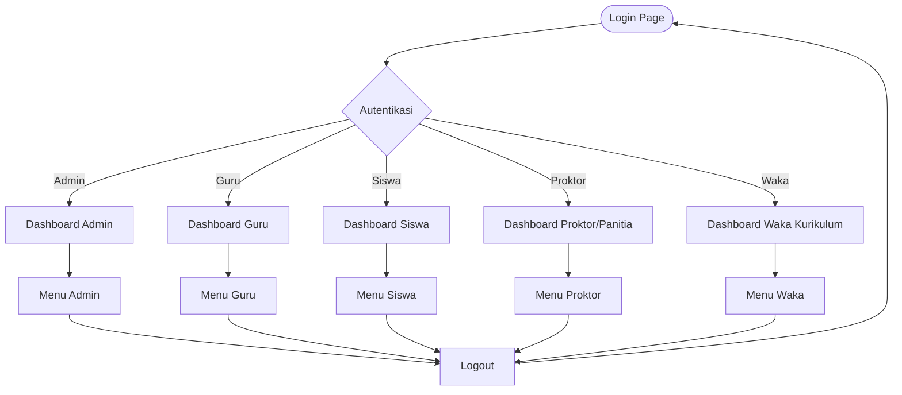

---

### A. Navigasi Administrator

Administrator memiliki akses penuh ke seluruh fitur sistem untuk mengelola data master dan monitoring.

```mermaid
graph LR
    Admin[Dashboard Admin] --> ManageUser[Manajemen User]
    Admin --> ManageAcademic[Manajemen Akademik]
    Admin --> ManageExam[Manajemen Ujian]
    Admin --> Monitoring[Monitoring Sistem]
    
    ManageUser --> UserList[Daftar User]
    ManageUser --> UserCreate[Tambah User]
    ManageUser --> UserImport[Import User Excel]
    ManageUser --> UserCard[Kartu Peserta]
    
    ManageAcademic --> JurusanMgmt[Kelola Jurusan]
    ManageAcademic --> KelasMgmt[Kelola Kelas]
    ManageAcademic --> MapelMgmt[Kelola Mata Pelajaran]
    
    KelasMgmt --> KelasImport[Import Siswa ke Kelas]
    
    ManageExam --> UjianList[Daftar Ujian]
    ManageExam --> BankSoalList[Bank Soal]
    ManageExam --> PengawasSchedule[Jadwal Pengawas]
    
    Monitoring --> MonitorReal[Monitoring Real-time]
    Monitoring --> LaporanNilai[Laporan Nilai]
    Monitoring --> AnalisisUjian[Analisis Ujian]
```

**Menu Administrator:**
1. **Dashboard**
   - Statistik total user (Guru, Siswa, Proktor)
   - Statistik ujian aktif
   - Statistik bank soal
   - Quick actions

2. **Manajemen User**
   - Daftar semua user
   - Tambah/Edit/Hapus user
   - Import user dari Excel
   - Generate kartu peserta ujian

3. **Manajemen Akademik**
   - Kelola Jurusan (IPA, IPS, TKJ, dll)
   - Kelola Kelas (X, XI, XII dengan jurusan)
   - Kelola Mata Pelajaran
   - Import siswa ke kelas dari Excel

4. **Manajemen Ujian**
   - Lihat semua bank soal
   - Lihat semua ujian
   - Kelola jadwal pengawas

5. **Monitoring & Laporan**
   - Monitoring ujian real-time
   - Laporan nilai siswa
   - Analisis hasil ujian

---

### B. Navigasi Guru

Guru dapat mengelola bank soal, membuat ujian, dan menilai hasil ujian siswa.

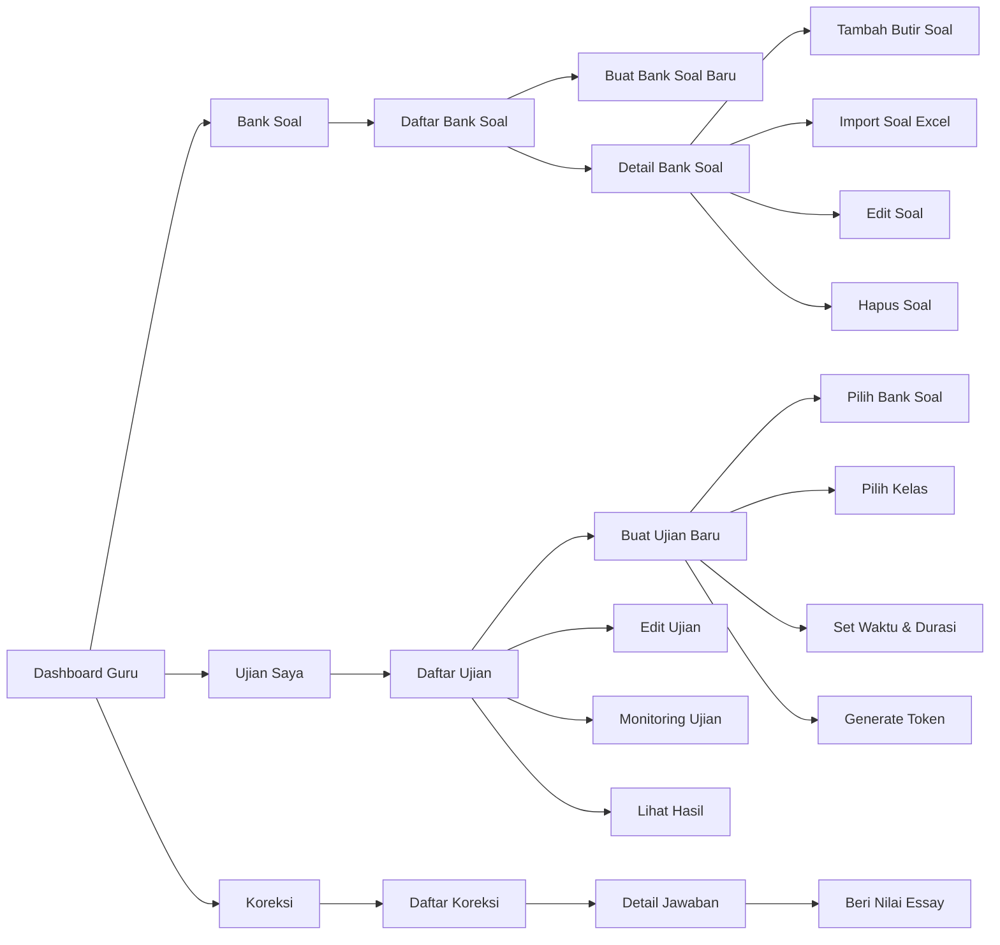

**Menu Guru:**
1. **Dashboard**
   - Bank soal yang dibuat
   - Ujian yang dibuat
   - Ujian aktif saat ini
   - Ujian yang perlu koreksi

2. **Bank Soal**
   - Daftar bank soal (filter by mapel)
   - Buat bank soal baru
   - Detail bank soal
     - Tambah butir soal (PG/Essay)
     - Import soal dari Excel
     - Edit/hapus butir soal
     - Preview soal

3. **Ujian**
   - Daftar ujian yang dibuat
   - Buat ujian baru
     - Pilih bank soal
     - Pilih kelas peserta
     - Set waktu & durasi
     - Generate token akses
   - Edit ujian
   - Monitoring ujian real-time
   - Lihat hasil ujian
   - Analisis ujian

4. **Koreksi**
   - Daftar ujian yang perlu koreksi
   - Detail jawaban siswa per soal
   - Beri nilai untuk soal essay
   - Submit nilai akhir

---

### C. Navigasi Siswa

Siswa dapat melihat ujian yang tersedia dan mengerjakan ujian sesuai jadwal.

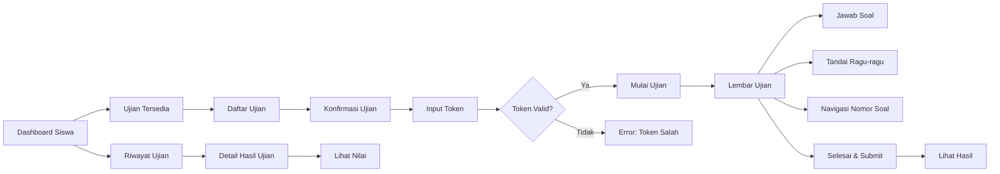

**Menu Siswa:**
1. **Dashboard**
   - Ujian yang tersedia (sesuai kelas)
   - Ujian sedang berlangsung
   - Riwayat ujian yang sudah selesai
   - Informasi profil

2. **Ujian Tersedia**
   - Daftar ujian sesuai kelas
   - Informasi detail ujian
     - Nama ujian
     - Mata pelajaran
     - Waktu & durasi
     - Jumlah soal
   - Konfirmasi ikut ujian
   - Input token akses

3. **Lembar Ujian**
   - Timer countdown
   - Navigasi nomor soal
   - Indikator status (terjawab/ragu/kosong)
   - Form jawaban (PG/Essay)
   - Tombol ragu-ragu
   - Tombol selesai ujian

4. **Riwayat Ujian**
   - Daftar ujian yang sudah dikerjakan
   - Status (dinilai/belum dinilai)
   - Nilai akhir
   - Detail jawaban

---

### D. Navigasi Proktor/Panitia

Proktor bertugas mengawasi jalannya ujian dan melakukan monitoring real-time.

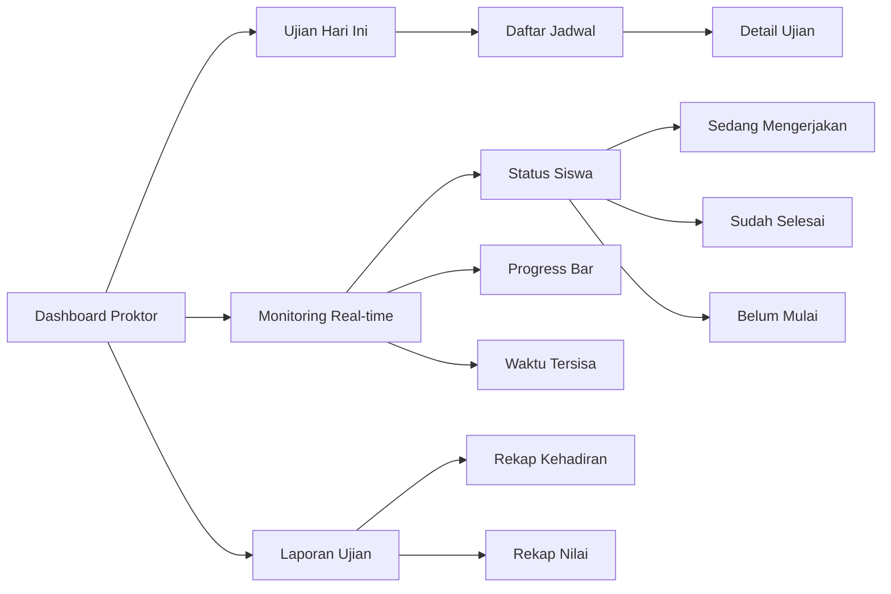

**Menu Proktor:**
1. **Dashboard**
   - Ujian yang diawasi hari ini
   - Statistik kehadiran
   - Status ujian berlangsung

2. **Monitoring Real-time**
   - Daftar siswa per kelas
   - Status pengerjaan (progress)
   - Waktu tersisa per siswa
   - Jumlah soal terjawab
   - Indikator online/offline
   - Alert siswa selesai

3. **Jadwal Pengawasan**
   - Daftar ujian yang diawasi
   - Detail kelas yang diawasi
   - Informasi waktu & tempat

4. **Laporan**
   - Rekap kehadiran siswa
   - Rekap nilai per kelas
   - Export laporan

---

### E. Navigasi Waka Kurikulum

Waka Kurikulum dapat melihat laporan dan analisis sistem secara keseluruhan.

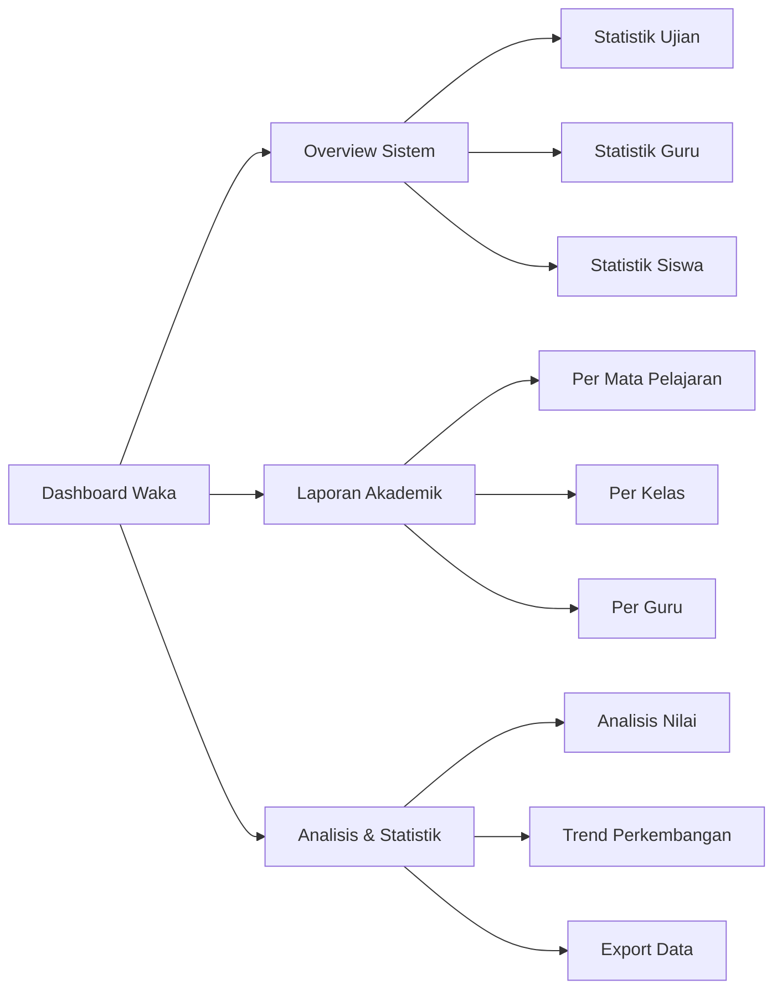

**Menu Waka Kurikulum:**
1. **Dashboard**
   - Overview statistik sistem
   - Total ujian semester ini
   - Rata-rata nilai per mapel
   - Trend nilai

2. **Laporan Akademik**
   - Laporan per mata pelajaran
   - Laporan per kelas
   - Laporan per guru pengampu
   - Filter berdasarkan semester

3. **Analisis & Statistik**
   - Analisis nilai siswa
   - Perbandingan antar kelas
   - Trend perkembangan nilai
   - Grafik visualisasi
   - Export ke Excel/PDF

---

## 4.3.2. Diagram HIPO (Hierarchy plus Input-Process-Output)

Diagram HIPO menggambarkan hierarki modul sistem dan alur Input-Process-Output untuk setiap fungsi utama.

### A. HIPO Level 0 - Sistem CBT Keseluruhan

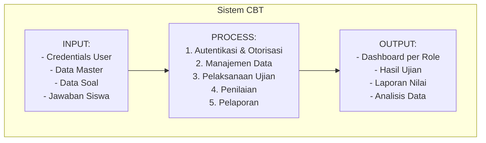

**Penjelasan:**
- **INPUT**: Data yang masuk ke sistem (login credentials, data master, soal, jawaban)
- **PROCESS**: Proses utama yang dilakukan sistem
- **OUTPUT**: Hasil yang dihasilkan sistem (dashboard, nilai, laporan)

---

### B. HIPO Level 1 - Modul Utama Sistem

```mermaid
graph TB
    subgraph "1.0 Autentikasi & Otorisasi"
        I1[INPUT:<br/>Username<br/>Password]
        P1[PROCESS:<br/>Login<br/>Validasi Role<br/>Redirect]
        O1[OUTPUT:<br/>Session<br/>Dashboard]
        I1-->P1-->O1
    end
    
    subgraph "2.0 Manajemen Data Master"
        I2[INPUT:<br/>Data User<br/>Data Akademik<br/>File Excel]
        P2[PROCESS:<br/>CRUD User<br/>CRUD Kelas/Jurusan<br/>Import Data]
        O2[OUTPUT:<br/>Data Tersimpan<br/>Notifikasi]
        I2-->P2-->O2
    end
    
    subgraph "3.0 Manajemen Bank Soal"
        I3[INPUT:<br/>Data Soal<br/>Opsi Jawaban<br/>Kunci Jawaban<br/>File Excel]
        P3[PROCESS:<br/>Buat Bank Soal<br/>Input Soal<br/>Import Soal<br/>Validasi]
        O3[OUTPUT:<br/>Bank Soal<br/>Daftar Soal]
        I3-->P3-->O3
    end
    
    subgraph "4.0 Manajemen Ujian"
        I4[INPUT:<br/>Bank Soal<br/>Kelas<br/>Jadwal<br/>Durasi]
        P4[PROCESS:<br/>Buat Ujian<br/>Generate Token<br/>Set Pengawas<br/>Aktivasi]
        O4[OUTPUT:<br/>Ujian Aktif<br/>Token Akses]
        I4-->P4-->O4
    end
    
    subgraph "5.0 Pelaksanaan Ujian"
        I5[INPUT:<br/>Token<br/>Device ID<br/>Jawaban Siswa]
        P5[PROCESS:<br/>Validasi Token<br/>Buat Sesi<br/>Simpan Jawaban<br/>Timer Control]
        O5[OUTPUT:<br/>Jawaban Tersimpan<br/>Progress Update]
        I5-->P5-->O5
    end
    
    subgraph "6.0 Penilaian"
        I6[INPUT:<br/>Jawaban Siswa<br/>Kunci Jawaban<br/>Nilai Essay]
        P6[PROCESS:<br/>Auto Grading PG<br/>Manual Grading Essay<br/>Hitung Total]
        O6[OUTPUT:<br/>Nilai Akhir<br/>Detail Jawaban]
        I6-->P6-->O6
    end
    
    subgraph "7.0 Monitoring & Laporan"
        I7[INPUT:<br/>Data Sesi<br/>Data Nilai<br/>Filter Parameter]
        P7[PROCESS:<br/>Real-time Monitoring<br/>Generate Laporan<br/>Analisis Data]
        O7[OUTPUT:<br/>Dashboard Monitoring<br/>Laporan PDF/Excel<br/>Statistik]
        I7-->P7-->O7
    end
```

---

### C. HIPO Level 2 - Detail Modul Pelaksanaan Ujian (Modul Kritis)

```mermaid
graph TB
    subgraph "5.1 Validasi & Mulai Ujian"
        I51[INPUT:<br/>- ID Siswa<br/>- Token Ujian<br/>- Device ID]
        P51[PROCESS:<br/>1. Validasi token<br/>2. Cek jadwal<br/>3. Cek duplikasi sesi<br/>4. Buat sesi baru]
        O51[OUTPUT:<br/>- Sesi Ujian<br/>- Lembar Soal<br/>- Timer Start]
        I51-->P51-->O51
    end
    
    subgraph "5.2 Menjawab Soal"
        I52[INPUT:<br/>- ID Sesi<br/>- ID Soal<br/>- Jawaban<br/>- Status Ragu]
        P52[PROCESS:<br/>1. Validasi sesi<br/>2. Save jawaban<br/>3. Update timestamp<br/>4. Sync ke DB]
        O52[OUTPUT:<br/>- Jawaban Tersimpan<br/>- Status Update<br/>- Auto-save Success]
        I52-->P52-->O52
    end
    
    subgraph "5.3 Navigasi Soal"
        I53[INPUT:<br/>- Nomor Soal<br/>- Action: Next/Prev]
        P53[PROCESS:<br/>1. Load soal<br/>2. Load jawaban<br/>3. Update UI<br/>4. Track progress]
        O53[OUTPUT:<br/>- Soal Ditampilkan<br/>- Jawaban Loaded<br/>- Progress Indicator]
        I53-->P53-->O53
    end
    
    subgraph "5.4 Timer & Auto Submit"
        I54[INPUT:<br/>- Waktu Tersisa<br/>- Status Ujian]
        P54[PROCESS:<br/>1. Countdown timer<br/>2. Cek waktu habis<br/>3. Auto submit<br/>4. Hitung nilai PG]
        O54[OUTPUT:<br/>- Timer Display<br/>- Ujian Selesai<br/>- Nilai Sementara]
        I54-->P54-->O54
    end
    
    subgraph "5.5 Submit Ujian"
        I55[INPUT:<br/>- ID Sesi<br/>- Trigger Submit]
        P55[PROCESS:<br/>1. Konfirmasi submit<br/>2. Finalisasi sesi<br/>3. Hitung nilai PG otomatis<br/>4. Set status]
        O55[OUTPUT:<br/>- Status: FINISHED<br/>- Nilai PG<br/>- Redirect ke Hasil]
        I55-->P55-->O55
    end
```

---

### D. Tabel HIPO - Modul Pelaksanaan Ujian (Format Akademik)

| Modul | Input | Process | Output |
|-------|-------|---------|--------|
| **5.1 Validasi & Mulai Ujian** | - ID Siswa<br>- Token Ujian<br>- Device ID | 1. Validasi token dengan data ujian<br>2. Cek jadwal waktu mulai & selesai<br>3. Cek apakah siswa sudah memiliki sesi aktif<br>4. Buat sesi ujian baru dengan timer<br>5. Load semua soal dari bank soal | - Sesi Ujian (status: ONGOING)<br>- Lembar Soal (random/sequence)<br>- Timer countdown dimulai |
| **5.2 Menjawab Soal** | - ID Sesi<br>- ID Soal<br>- Jawaban (PG/Essay)<br>- Flag Ragu-ragu | 1. Validasi sesi masih aktif<br>2. Simpan/update jawaban ke database<br>3. Update timestamp jawaban<br>4. Sync data real-time<br>5. Update status soal (terjawab/ragu) | - Jawaban tersimpan di database<br>- Status update berhasil<br>- Progress soal terupdate |
| **5.3 Navigasi Soal** | - Nomor Soal Tujuan<br>- Action (Next/Previous/Jump) | 1. Load data soal berdasarkan nomor<br>2. Load jawaban siswa (jika ada)<br>3. Render pertanyaan, opsi, gambar<br>4. Update indikator navigasi<br>5. Track progress pengerjaan | - Soal ditampilkan di layar<br>- Jawaban sebelumnya di-load<br>- Progress indicator terupdate<br>- Nomor soal aktif highlighted |
| **5.4 Timer & Auto Submit** | - Waktu Tersisa<br>- Durasi Ujian<br>- Status Sesi | 1. Countdown timer setiap detik<br>2. Sync waktu tersisa ke database<br>3. Cek jika waktu habis<br>4. Trigger auto-submit saat waktu = 0<br>5. Hitung nilai PG otomatis | - Timer display countdown<br>- Alert waktu tersisa<br>- Auto submit saat waktu habis<br>- Nilai PG terhitung |
| **5.5 Submit Ujian** | - ID Sesi<br>- Trigger Submit (Manual/Auto)<br>- Konfirmasi User | 1. Pop-up konfirmasi submit<br>2. Finalisasi semua jawaban<br>3. Set waktu_selesai<br>4. Hitung nilai PG otomatis<br>5. Set status: WAITING_GRADE/GRADED<br>6. Update score sesi | - Status sesi: FINISHED<br>- is_finished = True<br>- Nilai PG tersimpan<br>- Redirect ke halaman hasil<br>- Notifikasi berhasil |

---

### E. Flowchart User Journey - Siswa Mengerjakan Ujian

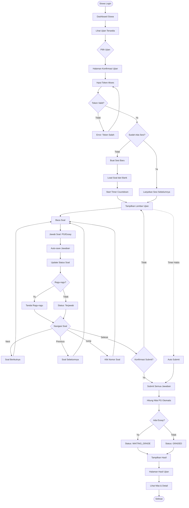

---

## 4.3.3. Wireframe Tampilan Utama

Berikut adalah wireframe sederhana untuk tampilan-tampilan utama sistem:

### A. Halaman Login

```
┌─────────────────────────────────────────────┐
│          SISTEM CBT - SMK NEGERI 1          │
│                                             │
│    ┌─────────────────────────────────┐     │
│    │         LOGO SEKOLAH            │     │
│    └─────────────────────────────────┘     │
│                                             │
│    ┌─────────────────────────────────┐     │
│    │  Username: [_____________]      │     │
│    │  Password: [_____________]      │     │
│    │                                 │     │
│    │       [    LOGIN    ]          │     │
│    └─────────────────────────────────┘     │
│                                             │
│        © 2026 Computer Based Test          │
└─────────────────────────────────────────────┘
```

---

### B. Dashboard Siswa

```
┌─────────────────────────────────────────────────────────────┐
│ [LOGO]  SISTEM CBT           Halo, [Nama Siswa]  [Logout]   │
├─────────────────────────────────────────────────────────────┤
│                                                             │
│  DASHBOARD SISWA - Kelas XI IPA 1                           │
│                                                             │
│  ┌───────────────┐  ┌───────────────┐  ┌───────────────┐  │
│  │   UJIAN       │  │   UJIAN       │  │   RIWAYAT     │  │
│  │  TERSEDIA     │  │  BERLANGSUNG  │  │    UJIAN      │  │
│  │      3        │  │       1       │  │      12       │  │
│  └───────────────┘  └───────────────┘  └───────────────┘  │
│                                                             │
│  UJIAN YANG TERSEDIA                                        │
│  ┌─────────────────────────────────────────────────────┐   │
│  │ 📝 Ujian Matematika - Semester Ganjil               │   │
│  │    Waktu: 27 Jan 2026, 10:00 - 12:00               │   │
│  │    Durasi: 120 menit | Soal: 40                    │   │
│  │    Status: [Belum Dimulai]        [IKUT UJIAN] ──► │   │
│  └─────────────────────────────────────────────────────┘   │
│  ┌─────────────────────────────────────────────────────┐   │
│  │ 📝 Ujian Bahasa Indonesia                           │   │
│  │    Waktu: 28 Jan 2026, 08:00 - 10:00               │   │
│  │    Durasi: 90 menit | Soal: 30                     │   │
│  │    Status: [Belum Dimulai]        [IKUT UJIAN] ──► │   │
│  └─────────────────────────────────────────────────────┘   │
│                                                             │
└─────────────────────────────────────────────────────────────┘
```

---

### C. Halaman Konfirmasi Ujian (Input Token)

```
┌─────────────────────────────────────────────────────────────┐
│ [LOGO]  SISTEM CBT                          [Nama]  [Logout]│
├─────────────────────────────────────────────────────────────┤
│                                                             │
│         KONFIRMASI IKUT UJIAN                               │
│                                                             │
│  ┌───────────────────────────────────────────────────────┐ │
│  │                                                       │ │
│  │  Nama Ujian    : Ujian Matematika - Semester Ganjil  │ │
│  │  Mata Pelajaran: Matematika                          │ │
│  │  Waktu Mulai   : 27 Januari 2026, 10:00             │ │
│  │  Durasi        : 120 menit (2 jam)                   │ │
│  │  Jumlah Soal   : 40 soal (35 PG, 5 Essay)           │ │
│  │  Guru Pengampu : Budi Santoso, S.Pd                 │ │
│  │                                                       │ │
│  │  ───────────────────────────────────────────────────  │ │
│  │                                                       │ │
│  │  Masukkan Token Akses Ujian:                         │ │
│  │                                                       │ │
│  │         ┌─────────────────────────┐                  │ │
│  │         │  [______]               │                  │ │
│  │         └─────────────────────────┘                  │ │
│  │                                                       │ │
│  │         (Token 6 digit dari guru/proktor)            │ │
│  │                                                       │ │
│  │      [  BATAL  ]         [  MULAI UJIAN  ]          │ │
│  │                                                       │ │
│  └───────────────────────────────────────────────────────┘ │
│                                                             │
└─────────────────────────────────────────────────────────────┘
```

---

### D. Lembar Ujian (Interface Mengerjakan Soal)

```
┌──────────────────────────────────────────────────────────────────────┐
│ UJIAN: Matematika Semester Ganjil              ⏱ Waktu: 01:45:30    │
├──────────────────────────────────────────────────────────────────────┤
│                                                                      │
│  Navigasi Soal:                                                      │
│  ┌──┐ ┌──┐ ┌──┐ ┌──┐ ┌──┐ ┌──┐ ┌──┐ ┌──┐ ┌──┐ ┌──┐               │
│  │1 │ │2 │ │3 │ │4 │ │5 │ │6 │ │7 │ │8 │ │9 │ │10│  ...          │
│  └──┘ └──┘ └──┘ └──┘ └──┘ └──┘ └──┘ └──┘ └──┘ └──┘               │
│   ✓    ✓    ●    ○    ?    ○    ○    ○    ○    ○                │
│                                                                      │
│  Keterangan:                                                         │
│  - ✓ Terjawab │ ? Ragu-ragu │ ○ Belum dijawab │ ● Soal Aktif       │
│                                                                      │
│  ────────────────────────────────────────────────────────────────   │
│                                                                      │
│  SOAL NOMOR 3                                          [PG] [Bobot:1]│
│                                                                      │
│  Jika f(x) = 2x + 3 dan g(x) = x² - 1, maka nilai dari (f ∘ g)(2)  │
│  adalah...                                                           │
│                                                                      │
│   ○ A. 7                                                            │
│   ○ B. 9                                                            │
│   ● C. 11                                                           │
│   ○ D. 13                                                           │
│   ○ E. 15                                                           │
│                                                                      │
│   ☐ Ragu-ragu dengan jawaban ini                                    │
│                                                                      │
│  ────────────────────────────────────────────────────────────────   │
│                                                                      │
│  Progress: 2/40 soal terjawab (5%)                                   │
│  ▓▓░░░░░░░░░░░░░░░░░░░░░░░░░░░░░░░░░░░░░░                          │
│                                                                      │
│  [ ◄ SEBELUMNYA ]              [ BERIKUTNYA ► ]   [ SELESAI UJIAN ] │
│                                                                      │
└──────────────────────────────────────────────────────────────────────┘
```

---

### E. Dashboard Guru

```
┌─────────────────────────────────────────────────────────────────┐
│ [LOGO]  SISTEM CBT              Halo, Budi Santoso  [Logout]    │
├─────────────────────────────────────────────────────────────────┤
│                                                                 │
│  DASHBOARD GURU - Matematika                                    │
│                                                                 │
│  ┌──────────┐  ┌──────────┐  ┌──────────┐  ┌──────────┐       │
│  │  BANK    │  │  UJIAN   │  │  UJIAN   │  │  PERLU   │       │
│  │  SOAL    │  │  DIBUAT  │  │  AKTIF   │  │  KOREKSI │       │
│  │    8     │  │    12    │  │     2    │  │     3    │       │
│  └──────────┘  └──────────┘  └──────────┘  └──────────┘       │
│                                                                 │
│  MENU CEPAT                                                     │
│  [+ Buat Bank Soal]  [+ Buat Ujian]  [📊 Lihat Laporan]       │
│                                                                 │
│  UJIAN AKTIF SAAT INI                                           │
│  ┌───────────────────────────────────────────────────────┐     │
│  │ 📝 Ujian Matematika - Semester Ganjil                 │     │
│  │    Kelas: XI IPA 1, XI IPA 2                          │     │
│  │    Peserta: 60 siswa | Selesai: 15 | Mengerjakan: 45  │     │
│  │    [MONITORING] [LIHAT HASIL] [EDIT]                  │     │
│  └───────────────────────────────────────────────────────┘     │
│                                                                 │
│  BANK SOAL TERBARU                                              │
│  ┌───────────────────────────────────────────────────────┐     │
│  │ Aljabar Semester 1      │ Matematika │ 50 soal        │     │
│  │ [LIHAT DETAIL] [EDIT] [BUAT UJIAN]                   │     │
│  └───────────────────────────────────────────────────────┘     │
│                                                                 │
└─────────────────────────────────────────────────────────────────┘
```

---

### F. Halaman Monitoring Real-time (Proktor)

```
┌─────────────────────────────────────────────────────────────────────┐
│ [LOGO]  MONITORING UJIAN                      Proktor  [Logout]     │
├─────────────────────────────────────────────────────────────────────┤
│                                                                     │
│  MONITORING REAL-TIME: Ujian Matematika - Kelas XI IPA 1           │
│  Waktu Ujian: 10:00 - 12:00 | Durasi: 120 menit | Soal: 40        │
│                                                                     │
│  ┌──────────────┐  ┌──────────────┐  ┌──────────────┐             │
│  │  HADIR       │  │  MENGERJAKAN │  │   SELESAI    │             │
│  │    28/30     │  │      15      │  │      13      │             │
│  └──────────────┘  └──────────────┘  └──────────────┘             │
│                                                                     │
│  DAFTAR SISWA                                   Refresh: Auto (5s)  │
│  ┌───────────────────────────────────────────────────────────────┐ │
│  │ No │ NISN       │ Nama Siswa     │ Status      │ Progress    │ │
│  ├───────────────────────────────────────────────────────────────┤ │
│  │ 1  │ 0012345678 │ Ahmad Fauzi    │ Mengerjakan │ 25/40 (62%) │ │
│  │    │            │                │ ⏱ 01:15:30  │ ▓▓▓▓▓░░░░   │ │
│  ├───────────────────────────────────────────────────────────────┤ │
│  │ 2  │ 0012345679 │ Siti Nurhaliza │ ✅ Selesai   │ 40/40 (100%)│ │
│  │    │            │                │ Finish: 11:30│ ▓▓▓▓▓▓▓▓▓   │ │
│  ├───────────────────────────────────────────────────────────────┤ │
│  │ 3  │ 0012345680 │ Budi Santoso   │ Mengerjakan │ 18/40 (45%) │ │
│  │    │            │                │ ⏱ 01:15:30  │ ▓▓▓▓░░░░░   │ │
│  ├───────────────────────────────────────────────────────────────┤ │
│  │ 4  │ 0012345681 │ Dewi Lestari   │ ⚠ Belum Mulai│ 0/40 (0%)  │ │
│  │    │            │                │              │ ░░░░░░░░░   │ │
│  └───────────────────────────────────────────────────────────────┘ │
│                                                                     │
│  [📥 EXPORT DATA] [📊 LIHAT STATISTIK] [🔄 REFRESH]               │
│                                                                     │
└─────────────────────────────────────────────────────────────────────┘
```

---

## 4.3.4. Teknologi yang Digunakan

| Komponen | Teknologi | Keterangan |
|----------|-----------|------------|
| **Backend Framework** | Django 5.x | Python web framework untuk logic aplikasi |
| **Frontend** | HTML5, CSS3, JavaScript | Tampilan antarmuka pengguna |
| **Database** | SQLite / PostgreSQL / MySQL | Penyimpanan data relasional |
| **CSS Framework** | Bootstrap 5 | Styling dan responsive design |
| **Icons** | Font Awesome | Icon library |
| **Charts** | Chart.js | Visualisasi grafik dan statistik |
| **Real-time** | Django Channels (Optional) | WebSocket untuk monitoring real-time |
| **Authentication** | Django Auth System | Sistem autentikasi built-in Django |
| **File Upload** | Django FileField | Upload file Excel untuk import data |
| **Export** | ReportLab / openpyxl | Generate PDF dan Excel reports |

---

## 4.3.5. Alur Kerja Sistem Secara Keseluruhan

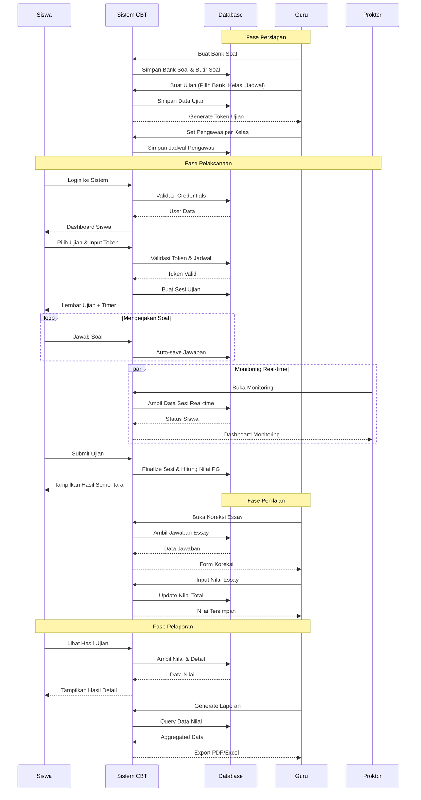

---

## 4.3.6. Kesimpulan Rancangan Program

Rancangan program Sistem CBT ini telah dirancang dengan mempertimbangkan:

1. **User-Centered Design**: Setiap role memiliki navigasi yang sesuai dengan kebutuhan dan hak aksesnya
2. **Modular Structure**: Sistem terbagi menjadi modul-modul yang independen dan mudah dimaintain
3. **Clear Workflow**: Alur kerja yang jelas dari persiapan hingga pelaporan
4. **Real-time Monitoring**: Fitur monitoring real-time untuk pengawasan ujian
5. **Responsive Interface**: Desain yang responsif dan mudah digunakan
6. **Scalable Architecture**: Arsitektur yang dapat dikembangkan sesuai kebutuhan masa depan

Struktur navigasi dan HIPO diagram di atas memberikan gambaran komprehensif tentang bagaimana sistem bekerja dan bagaimana pengguna berinteraksi dengan sistem pada setiap tahap proses ujian berbasis komputer.
